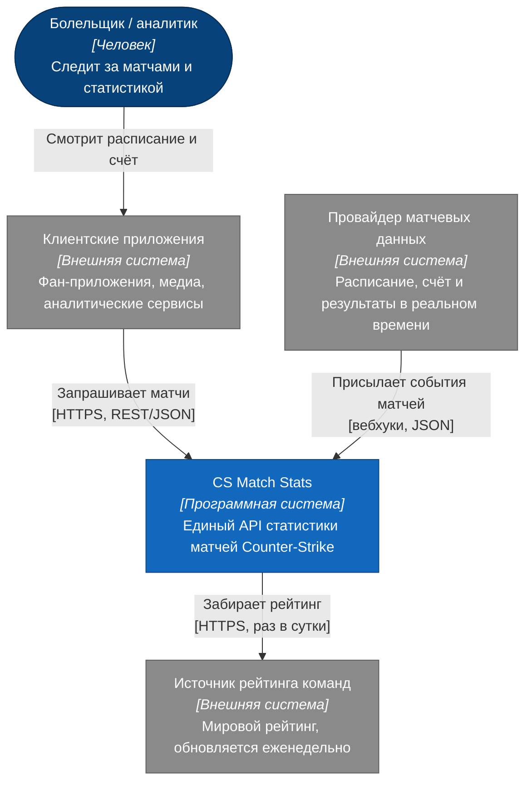
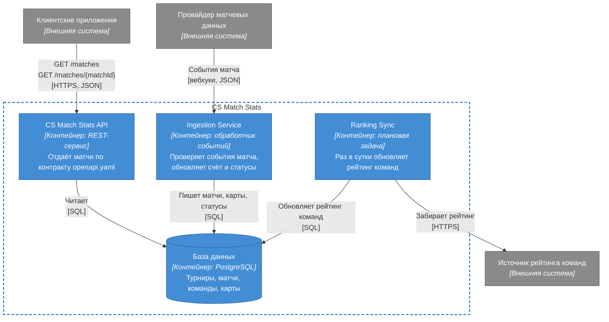

# Архитектура: модель C4

Два верхних уровня [модели C4](https://c4model.com): контекст (кто и с какими системами взаимодействует) и контейнеры (из каких развёртываемых частей состоит система). Нотация C4, отрисовано через mermaid `flowchart`, чтобы схема рендерилась прямо на GitHub.

Цвета по соглашению C4: тёмно-синий — люди, синий — наша система и её контейнеры, серый — внешние системы.

## Уровень 1. Контекст системы

| Элемент | Роль |
|---|---|
| Болельщик / аналитик | Конечный пользователь. С CS Match Stats напрямую не работает, только через клиентские приложения |
| Клиентские приложения | Потребители API: показывают расписание и live-счёт, строят аналитику |
| CS Match Stats | Система в фокусе: собирает данные из внешних источников и отдаёт их по единому контракту |
| Провайдер матчевых данных | Источник расписания и событий матча: старт карты, счёт, конец серии |
| Источник рейтинга команд | Источник мирового рейтинга для поля `worldRanking` |

## Уровень 2. Контейнеры

| Контейнер | Ответственность | Связанные артефакты |
|---|---|---|
| CS Match Stats API | Реализует публичный контракт: фильтры, пагинацию, ошибки. Только чтение | [openapi.yaml](openapi.yaml), [match-flow.md](match-flow.md) |
| Ingestion Service | Принимает события от провайдера, проверяет их и переводит матч по статусам. При старте матча фиксирует рейтинг команд | [match-lifecycle.md](match-lifecycle.md), [ADR-0003](adr/0003-ranking-snapshot.md) |
| Ranking Sync | Раз в сутки обновляет текущий рейтинг команд | [ADR-0003](adr/0003-ranking-snapshot.md) |
| База данных | Хранит турниры, матчи, участников и карты | [data-model.md](data-model.md) |

## Ключевые потоки

- **Чтение:** клиент → CS Match Stats API → база данных. Пошагово — в [match-flow.md](match-flow.md).
- **Запись:** провайдер → Ingestion Service → база данных. Правила смены статусов — в [match-lifecycle.md](match-lifecycle.md).
