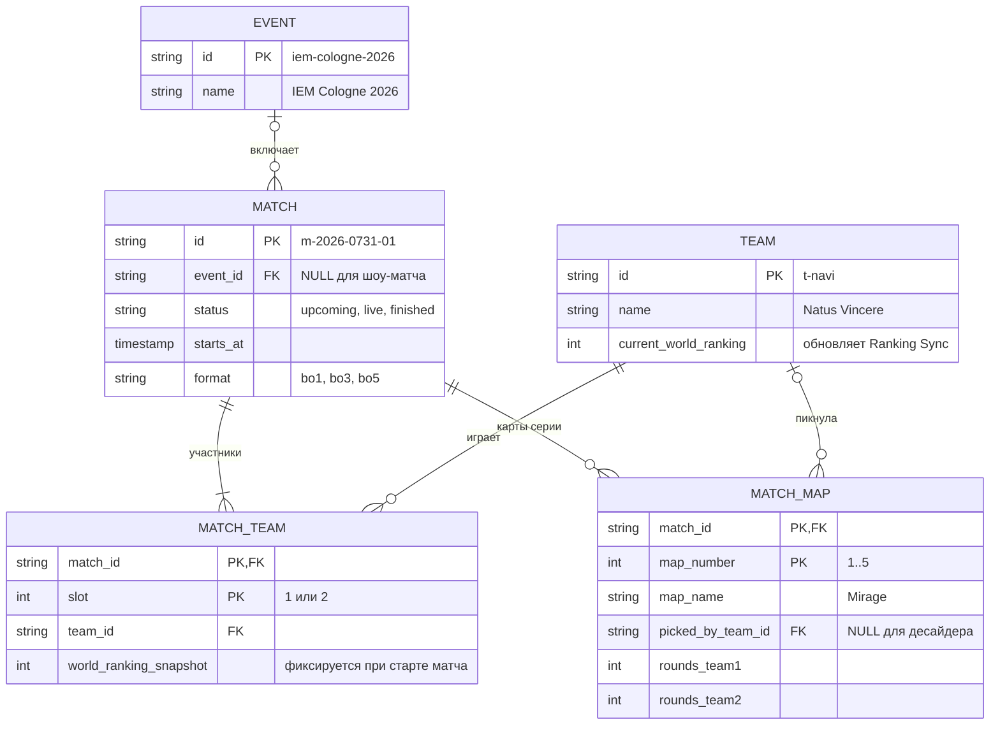

# Модель данных

Логическая модель, на которой держится API. Физическая схема БД может отличаться (индексы, служебные поля), но сущности и связи здесь те же.

## Сущности

| Сущность | Что хранит | Откуда данные |
|---|---|---|
| `EVENT` | Турнир | Провайдер матчевых данных |
| `MATCH` | Серию между двумя командами: статус, время начала, формат | Провайдер → Ingestion Service |
| `TEAM` | Команду и её текущее место в мировом рейтинге | Провайдер (команды), Ranking Sync (рейтинг) |
| `MATCH_TEAM` | Участие команды в матче: слот (team1 или team2) и рейтинг на момент матча | Ingestion Service |
| `MATCH_MAP` | Карту серии: порядковый номер, кто её выбрал, счёт по раундам | Ingestion Service |

## Бизнес-правила

1. У матча ровно два участника в слотах 1 и 2, и это разные команды.
2. Карт не больше, чем допускает формат: bo1 — 1, bo3 — 3, bo5 — 5.
3. `picked_by_team_id` — одна из двух команд матча или `NULL`, если карта — десайдер.
4. Счёт по раундам не может быть отрицательным.
5. `world_ranking_snapshot` заполняется при переходе матча в `live` и дальше не меняется ([ADR-0003](adr/0003-ranking-snapshot.md)).
6. Матч может проходить вне турнира (шоу-матч). Тогда `event_id` пустой и `eventName` в API не передаётся.

## Соответствие API и модели

| Поле API | Источник в модели |
|---|---|
| `Match.id`, `status`, `startsAt`, `format` | `MATCH.id`, `status`, `starts_at`, `format` |
| `Match.eventName` | `EVENT.name` через `MATCH.event_id` |
| `Match.teams[]` | `MATCH_TEAM` по возрастанию `slot`, данные команды из `TEAM` |
| `Team.worldRanking` | Для `upcoming` — `TEAM.current_world_ranking`, для `live` и `finished` — `MATCH_TEAM.world_ranking_snapshot` |
| `Match.maps[]` | `MATCH_MAP` по возрастанию `map_number` |
| `MapResult.pickedBy` | `MATCH_MAP.picked_by_team_id` |
| `MapResult.roundsTeam1`, `roundsTeam2` | `MATCH_MAP.rounds_team1`, `rounds_team2`; номер команды совпадает со `slot` |
| Фильтр `eventId` в `GET /matches` | `MATCH.event_id`. Через API его сейчас не узнать, см. [Q-1](README.md#открытые-вопросы) |
