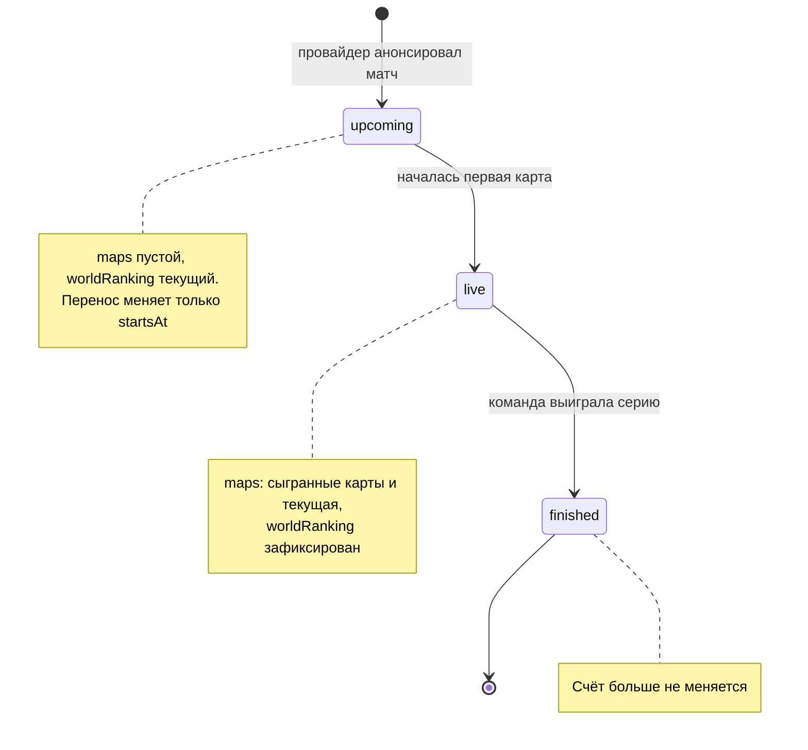

# Жизненный цикл матча

Статусы из `MatchStatus` в [openapi.yaml](openapi.yaml) и правила переходов между ними. Статусы меняет Ingestion Service по событиям провайдера матчевых данных ([architecture.md](architecture.md)).

## Что видит клиент в каждом статусе

| Статус | Когда наступает | `maps` | `worldRanking` |
|---|---|---|---|
| `upcoming` | Провайдер анонсировал матч | Пустой массив | Текущий рейтинг команды, до старта может измениться |
| `live` | Началась первая карта | Сыгранные карты и текущая с промежуточным счётом | Зафиксирован на момент старта |
| `finished` | Команда выиграла серию: 1 карту в bo1, 2 в bo3, 3 в bo5 | Все сыгранные карты | Зафиксирован |

## Правила переходов

1. Статус меняется только вперёд: `upcoming` → `live` → `finished`. Событие, которое ведёт назад (например, «матч начался» для завершённого матча), Ingestion Service отклоняет и логирует.
2. Перенос матча не меняет статус, обновляется только `startsAt`.
3. `finished` — конечный статус: одна из команд выиграла большинство карт серии.
4. При переходе в `live` рейтинг обеих команд фиксируется ([ADR-0003](adr/0003-ranking-snapshot.md)).

## Открытые вопросы

- Нет статуса для отменённых матчей и технических поражений, см. [Q-4](README.md#открытые-вопросы).
- В статусе `live` по ответу не понять, какая карта идёт прямо сейчас, см. [Q-3](README.md#открытые-вопросы).
