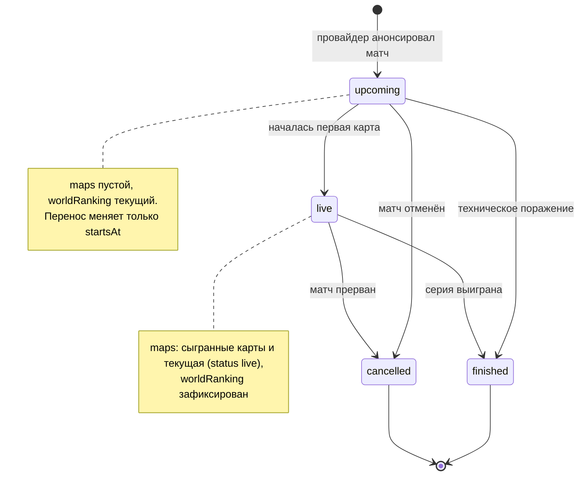

# Жизненный цикл матча

Статусы из `MatchStatus` в [openapi.yaml](openapi.yaml) и правила переходов между ними. Статусы меняет Ingestion Service по событиям провайдера матчевых данных ([architecture.md](architecture.md)).

## Что видит клиент в каждом статусе

| Статус | Когда наступает | `maps` | `worldRanking` | `winnerTeamId`, `forfeit` |
|---|---|---|---|---|
| `upcoming` | Провайдер анонсировал матч | Пустой массив | Текущий рейтинг команды, до старта может измениться | Не передаются |
| `live` | Началась первая карта | Сыгранные карты (`finished`) и текущая (`live`) | Зафиксирован | Не передаются |
| `finished` | Команда выиграла серию (1 карту в bo1, 2 в bo3, 3 в bo5) или получила техническую победу | Все сыгранные карты; при технической победе до старта — пустой | Зафиксирован | Победитель; `forfeit: true` при техническом поражении |
| `cancelled` | Матч отменён до старта или прерван без результата | Карты, сыгранные до отмены | Зафиксирован | Не передаются |

## Правила переходов

1. Статус меняется только вперёд, по стрелкам диаграммы. Событие, которое ведёт назад (например, «матч начался» для завершённого матча), Ingestion Service отклоняет и логирует.
2. Перенос матча не меняет статус, обновляется только `startsAt`.
3. `finished` и `cancelled` — конечные статусы.
4. Когда матч выходит из `upcoming` в любой статус, рейтинг обеих команд фиксируется ([ADR-0003](adr/0003-ranking-snapshot.md), [ADR-0004](adr/0004-cancelled-and-forfeit.md)).
5. Статус `cancelled` появляется в ответах API не раньше 2026-10-24. До этого отменённые матчи в списки не попадают ([ADR-0004](adr/0004-cancelled-and-forfeit.md)).
