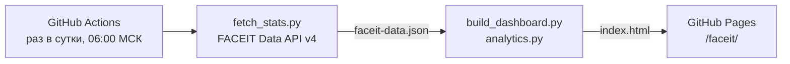

# FACEIT-дашборд

Статическая страница со статистикой игрока в CS2 на FACEIT: https://ifuzys.github.io/git-practice/faceit/

Что на странице:

- Elo, уровень и сводка за последние матчи: винрейт, K/D, ADR, процент хедшотов;
- выводы простыми правилами: лучшая и худшая карта, лучшее время для игры, форма последних 20 матчей против предыдущих 20;
- винрейт по картам и по времени суток — с размером выборки и отметкой, где матчей слишком мало для выводов;
- форма по K/D и ADR — скользящее среднее за 10 матчей;
- последние 20 матчей со ссылками на комнаты FACEIT.

Учитываются только матчи 5v5, время — московское.

## Настройка

Нужна один раз.

1. **Получить ключ API.** Войти на [developers.faceit.com](https://developers.faceit.com/) → App Studio → создать приложение → вкладка API keys → создать ключ типа **Server side**.
2. **Добавить ключ в репозиторий.** Settings → Secrets and variables → Actions → вкладка **Secrets** → New repository secret. Имя `FACEIT_API_KEY`, значение — ключ.
   Ключ хранится только в секретах GitHub: в коде, логах и на странице его нет. Не вставляйте его в чат, issue или файлы репозитория.
3. **Указать никнейм.** Там же, вкладка **Variables** → New repository variable. Имя `FACEIT_NICKNAME`, значение — никнейм на FACEIT (регистр важен).
4. **Запустить обновление.** Actions → GitHub Pages → Run workflow, ветка `main`.

Пока ключ или никнейм не заданы, по адресу дашборда открывается страница с этой инструкцией.

## Как это работает



| Файл | Что делает |
|---|---|
| [fetch_stats.py](fetch_stats.py) | Берёт профиль и статистику последних 200 матчей из FACEIT Data API v4, приводит её к простому JSON |
| [analytics.py](analytics.py) | Считает сводки, разбивки по картам и времени суток, скользящие средние, серии и выводы |
| [build_dashboard.py](build_dashboard.py) | Собирает самодостаточную HTML-страницу без внешних скриптов и CDN, со светлой и тёмной темой |
| [demo_data.py](demo_data.py) | Генерирует демо-матчи: на них проверяется вёрстка в pull request, где ключа нет |
| [test_dashboard.py](test_dashboard.py) | Тесты расчётов, разбора ответа API и экранирования данных на странице |

Как считаются показатели:

- **K/D** — сумма убийств, делённая на сумму смертей, а не среднее K/D по матчам: так длинные и короткие матчи весят честно.
- **ADR** — среднее по матчам, взвешенное по числу раундов.
- **Хедшоты** — доля убийств в голову от всех убийств.
- **Выводы** строятся только по выборкам от 5 матчей.

Если FACEIT API недоступен, сборка падает и публикация не происходит: на сайте остаётся предыдущая версия, а GitHub присылает письмо о сбое.

GitHub отключает расписание в публичных репозиториях, где 60 дней не было коммитов. Если дашборд перестал обновляться, включите workflow заново во вкладке Actions.

## Локальный запуск

Нужен Python 3.10+, сторонние пакеты не используются.

```bash
# демо-данные, без ключа
python faceit-dashboard/build_dashboard.py --demo --out preview

# реальные данные
export FACEIT_API_KEY=...        # ключ из шага 1
export FACEIT_NICKNAME=...
python faceit-dashboard/fetch_stats.py --out faceit-data.json
python faceit-dashboard/build_dashboard.py --data faceit-data.json --out preview

# тесты
python -m unittest discover -s faceit-dashboard
```

Откройте `preview/index.html` в браузере.
