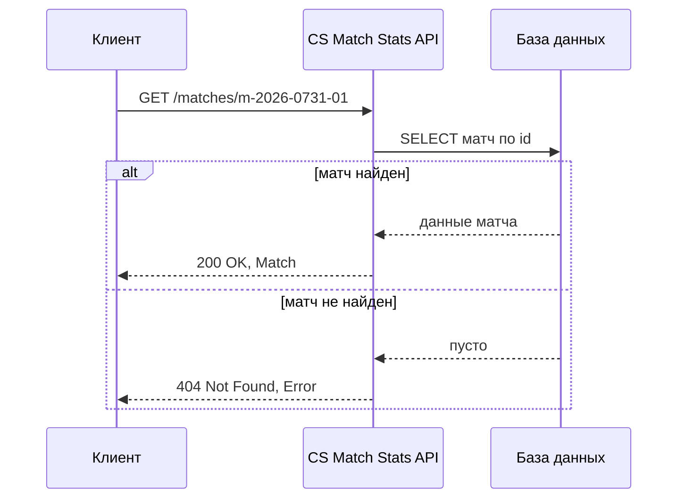

# Поток запроса: получение матча

Как `GET /matches/{matchId}` из `openapi.yaml` проходит через систему.

```mermaid
sequenceDiagram
    participant C as Клиент
    participant A as CS Match Stats API
    participant DB as База данных

    C->>A: GET /matches/m-2026-0731-01
    A->>DB: SELECT матч по id

    alt матч найден
        DB-->>A: данные матча
        A-->>C: 200 OK, Match
    else матч не найден
        DB-->>A: пусто
        A-->>C: 404 Not Found, Error
    end
```