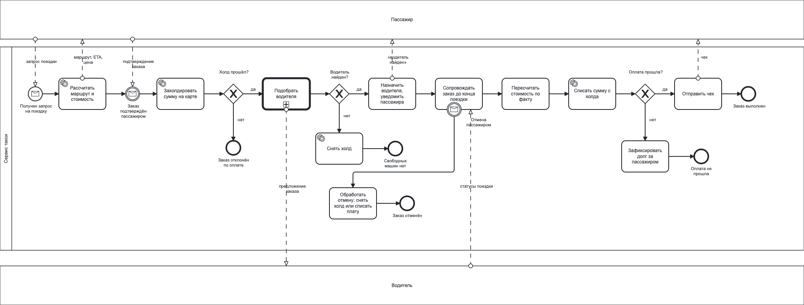
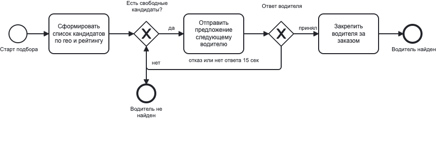
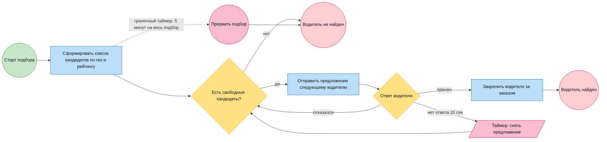

# BPMN: процесс заказа такси

Тот же заказ такси, что и в [taxi-order-flow.md](taxi-order-flow.md), но в нотации BPMN: акцент на участниках, точках принятия решений и вариантах завершения процесса, а не на обмене сообщениями между сервисами.

Исходник модели: [taxi-order.bpmn](taxi-order.bpmn) — стандартный BPMN 2.0, открывается и редактируется в Camunda Modeler, bpmn.io, Visual Paradigm.

## Модель в нотации BPMN 2.0

Отрисовано из `taxi-order.bpmn`.

Подпроцесс «Подобрать водителя» (отдельная диаграмма внутри того же файла):

## Упрощённая схема в mermaid

Версия для быстрого чтения и правок прямо в репозитории: рендерится в GitHub без моделлера, но не поддерживает граничные события, поэтому отмена заказа здесь не показана.

Сплошная стрелка — поток управления внутри пула, пунктирная — поток сообщений между пулами.

```mermaid
flowchart LR
    classDef ev fill:#c8e6c9,stroke:#2e7d32,color:#111
    classDef endok fill:#ffcdd2,stroke:#c62828,color:#111
    classDef task fill:#bbdefb,stroke:#1565c0,color:#111
    classDef sub fill:#b3e5fc,stroke:#0277bd,color:#111
    classDef gw fill:#ffe082,stroke:#f9a825,color:#111

    subgraph POOL_P["Пул: Пассажир"]
        direction LR
        P0((Нужна поездка)):::ev --> P1[Указать адрес и тариф]:::task
        P1 --> P2{Цена устраивает?}:::gw
        P2 -- нет --> PE1((Отказ от заказа)):::endok
        P2 -- да --> P3[Подтвердить заказ]:::task
        P3 --> P4[Дождаться машины]:::task
        P4 --> P5[Совершить поездку]:::task
        P5 --> P6[Оценить водителя]:::task
        P6 --> PE2((Поездка завершена)):::endok
    end

    subgraph POOL_S["Пул: Сервис такси — дорожка «Заказы»"]
        direction LR
        S0((Получен запрос цены)):::ev --> S1[Рассчитать маршрут и стоимость]:::task
        S1 --> S2[Создать заказ, статус SEARCHING]:::task
        S2 --> B1[Захолдировать сумму на карте]:::task
        B1 --> S3{Холд прошёл?}:::gw
        S3 -- нет --> SE1((Заказ отклонён)):::endok
        S3 -- да --> S4[[Подобрать водителя]]:::sub
        S4 --> S5{Водитель найден?}:::gw
        S5 -- нет --> B2[Снять холд]:::task
        B2 --> SE2((Свободных машин нет)):::endok
        S5 -- да --> S6[Назначить водителя, уведомить пассажира]:::task
        S6 --> S7[Вести заказ до завершения поездки]:::task
        S7 --> S8[Пересчитать стоимость по факту]:::task
        S8 --> B3[Списать сумму с холда]:::task
        B3 --> S9{Оплата прошла?}:::gw
        S9 -- да --> S10[Отправить чек]:::task
        S10 --> SE3((Заказ выполнен)):::endok
        S9 -- нет --> B4[Зафиксировать долг за пассажиром]:::task
        B4 --> SE4((Оплата не прошла)):::endok
    end

    subgraph POOL_D["Пул: Водитель"]
        direction LR
        D0((Поступило предложение)):::ev --> D1{Принять заказ?}:::gw
        D1 -- нет --> DE1((Заказ пропущен)):::endok
        D1 -- да --> D2[Приехать на точку подачи]:::task
        D2 --> D3[Отметить прибытие]:::task
        D3 --> D4[Выполнить поездку]:::task
        D4 --> D5[Завершить заказ]:::task
        D5 --> DE2((Заказ закрыт)):::endok
    end

    P1 -. запрос цены .-> S0
    S1 -. маршрут, ETA, цена .-> P2
    P3 -. подтверждение заказа .-> S2
    S4 -. предложение заказа .-> D0
    S6 -. «водитель найден» .-> P4
    D3 -. «машина подана» .-> P5
    D5 -. факт завершения .-> S8
    S10 -. чек .-> P6
```

### Подпроцесс «Подобрать водителя» в mermaid

Вынесен отдельно: внутри цикл с таймерами, который в основной схеме создавал бы шум.

## Легенда

| Элемент | Обозначение на схеме | Смысл |
| --- | --- | --- |
| Стартовое событие | зелёный круг | что запускает процесс |
| Задача | синий прямоугольник | шаг работы |
| Свёрнутый подпроцесс | голубой прямоугольник с двойной рамкой | отдельно смоделированный блок |
| Шлюз (XOR) | жёлтый ромб | развилка, идёт ровно одна ветка |
| Событие-таймер | розовый элемент | ограничение по времени |
| Конечное событие | красный круг | вариант завершения процесса |
| Поток управления | сплошная стрелка | порядок шагов внутри пула |
| Поток сообщений | пунктирная стрелка | взаимодействие между пулами |

## Почему схема выглядит именно так

- **Три пула, а не один.** Пассажир и водитель — внешние участники со своей логикой и правом сказать «нет». Их нельзя изображать задачами внутри процесса сервиса: сервис не управляет их поведением, он только обменивается с ними сообщениями.
- **Четыре конечных события у процесса сервиса.** Отклонён по оплате, нет машин, выполнен, оплата не прошла. Один общий «конец» скрыл бы то, ради чего строится BPMN, — разные исходы требуют разной обработки и разной аналитики по воронке.
- **Подбор водителя — подпроцесс.** Цикл «предложил → отказ/таймаут → следующий» и общий таймер на подбор — это самостоятельная логика. В основной схеме она не нужна, там важен только результат: нашли или нет.
- **Биллинговые шаги остались в пуле сервиса.** Платёжный шлюз — внешняя система, но не участник процесса с собственным поведением: он не принимает решений, а отвечает на вызов. Поэтому это задачи, а не отдельный пул.
- **Отмена заказа — граничное прерывающее событие.** Оно висит на задаче «Сопровождать заказ» и уводит процесс в отдельную ветку: снять холд или списать плату за отмену. Это точная семантика — отмена может прийти в любой момент сопровождения, а не в заранее определённой точке. В mermaid такой элемент не выражается, поэтому там ветки отмены нет.
