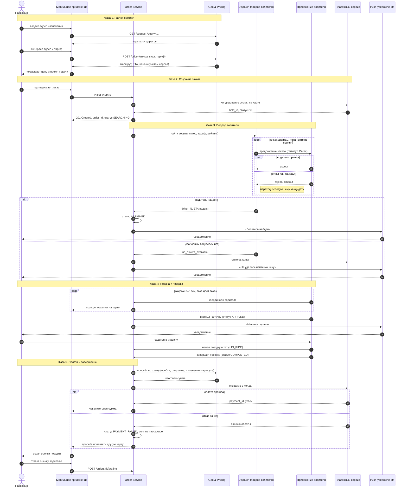
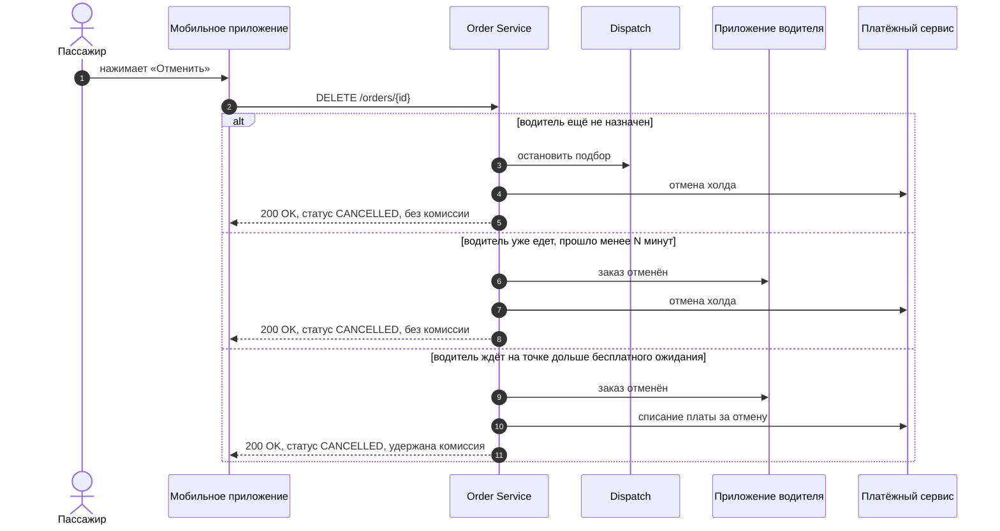

# Поток заказа такси

Полный жизненный цикл заказа: от ввода адреса до оплаты и оценки поездки.

## Основной сценарий

## Альтернативный сценарий: отмена заказа

## Статусы заказа

| Статус | Когда наступает |
| --- | --- |
| `SEARCHING` | заказ создан, идёт подбор водителя |
| `ASSIGNED` | водитель принял заказ и едет на точку |
| `ARRIVED` | водитель на месте подачи |
| `IN_RIDE` | пассажир в машине, поездка идёт |
| `COMPLETED` | поездка завершена, идёт расчёт |
| `PAID` | оплата прошла успешно |
| `PAYMENT_FAILED` | списание не прошло, зафиксирован долг |
| `CANCELLED` | заказ отменён пассажиром, водителем или системой |

## Ключевые решения в схеме

- **Холдирование до подбора водителя.** Сумма блокируется сразу после создания заказа — так система отсеивает неплатёжеспособных пассажиров до того, как отправит к ним машину. Итоговое списание идёт с холда после поездки.
- **Подбор — отдельный сервис.** Dispatch перебирает кандидатов в цикле с таймаутом на ответ, поэтому отказ одного водителя не роняет заказ.
- **Цена пересчитывается дважды.** Предварительная — до подтверждения, фактическая — после завершения: маршрут и время в пути меняются.
- **Трекинг вынесен в отдельный поток.** Координаты идут потоком (WebSocket или частый polling), а не в рамках основного запроса заказа.
