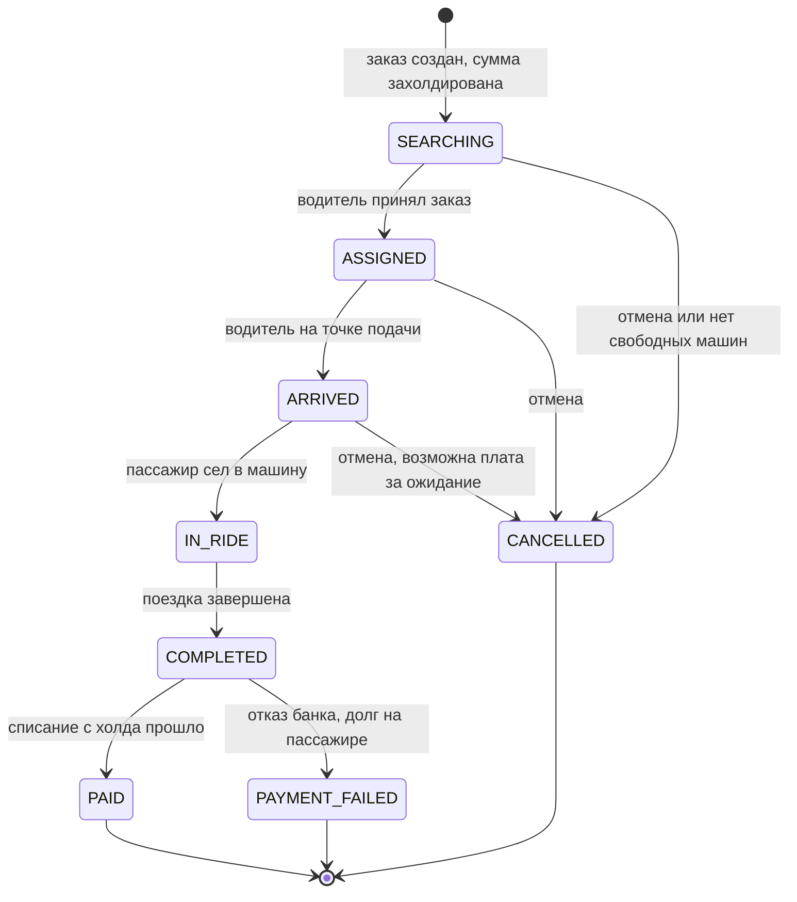

# Заказ такси — кейс системного аналитика

Процесс заказа такси от ввода адреса до оплаты и оценки поездки. Один и тот же процесс описан в двух нотациях: sequence показывает обмен сообщениями между сервисами, BPMN — участников, решения и варианты завершения.

## Навигация

| Артефакт | Что внутри |
|---|---|
| [taxi-order-flow.md](taxi-order-flow.md) | Sequence-диаграммы: основной сценарий в 5 фазах и отмена заказа, статусы заказа, ключевые решения |
| [taxi-order-bpmn.md](taxi-order-bpmn.md) | BPMN 2.0: три пула, подпроцесс подбора водителя, легенда и обоснование модели |
| [taxi-order.bpmn](taxi-order.bpmn) | Исходник BPMN 2.0: открывается в Camunda Modeler и bpmn.io |
| [taxi-order.png](taxi-order.png), [taxi-matching.png](taxi-matching.png) | Отрисовка основного процесса и подпроцесса подбора водителя |

## Участники

| Участник | Роль в процессе |
|---|---|
| Пассажир | Заказывает поездку, может отменить заказ и оценивает водителя |
| Водитель | Принимает или пропускает предложение, подаёт машину, выполняет поездку |
| Order Service | Ведёт заказ по статусам и координирует остальные сервисы |
| Geo & Pricing | Подсказки адресов, маршрут, предварительная и фактическая цена |
| Dispatch | Подбирает водителя: перебирает кандидатов с таймаутом на ответ |
| Платёжный сервис | Холдирует сумму, списывает её с холда или снимает холд |
| Push-уведомления | Сообщают пассажиру о ходе заказа |

## Жизненный цикл заказа

Статусы и переходы собраны из [sequence-диаграмм](taxi-order-flow.md#статусы-заказа).

