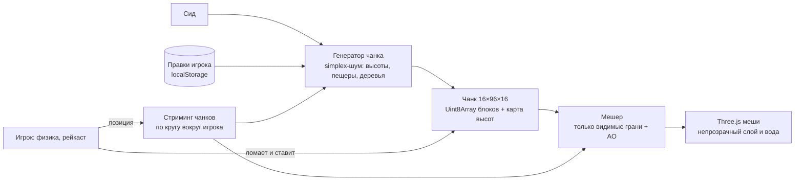

# Кубоземье

Воксельная песочница в духе Minecraft, которая работает прямо в браузере. Вся игра лежит в одном файле [index.html](index.html), без сборки и сервера.

## Как запустить

Откройте `index.html` в браузере: двойной клик или перетащите файл в окно. Нужен интернет, потому что Three.js и шрифты подгружаются с CDN.

## Что умеет

- Бесконечный процедурный мир по сиду: равнины, холмы, горы со снегом, озёра с песчаными берегами, пещеры-тоннели, угольная руда, леса.
- 15 типов блоков с процедурными пиксельными текстурами, которые рисуются в canvas при запуске.
- Ломание и установка блоков, выбор из хотбара, «взять блок под прицелом» (средняя кнопка мыши).
- Физика игрока: гравитация, прыжок, коллизии, бег, плавание, режим полёта.
- Смена дня и ночи: солнце, луна, звёзды, облака, закатное свечение.
- Мягкие тени (ambient occlusion) на гранях блоков и затенение под навесами и в пещерах.
- Сохранение мира и позиции в `localStorage`, у каждого браузера своё.
- Управление с телефона: джойстик, свайп для обзора, тап и удержание.

## Управление

| Действие | Клавиатура и мышь | Телефон |
|---|---|---|
| Ходьба | `W` `A` `S` `D` | Джойстик слева |
| Обзор | Мышь | Свайп справа |
| Сломать блок | ЛКМ, удерживайте, чтобы копать | Удержание |
| Поставить блок | ПКМ | Тап |
| Выбор блока | `1`–`9`, колесо | Тап по хотбару |
| Прыжок, всплыть | Пробел | Кнопка «Прыжок» |
| Бег | `Shift` | — |
| Полёт | `F` или двойной пробел, в полёте `Shift` вниз | Кнопка «Полёт», двойной тап по «Прыжку» |
| Пауза | `Esc` | Кнопка `II` |

## Как устроено

- **Мир** делится на чанки 16×16 блоков по горизонтали и 96 в высоту. Каждый чанк хранит блоки в плоском `Uint8Array` и карту высот, по которой считается затенение.
- **Генерация** детерминирована по сиду: одинаковый сид даёт одинаковый мир. Деревья вычисляются с запасом в 2 блока за границей чанка, поэтому кроны не обрезаются на стыках.
- **Правки игрока** хранятся отдельно от сгенерированных данных, как дельта `чанк → {индекс блока → тип}`. При повторной загрузке чанк генерируется заново, а дельта накладывается сверху. В сохранение попадают только изменения, а не весь мир.
- **Мешинг** строит только грани, которые граничат с воздухом или прозрачным блоком, и запекает в цвет вершин освещение: сторону грани, ambient occlusion и тень от блоков сверху. Чанк собирается, когда загружены все 8 соседей, иначе на стыках появились бы лишние грани.
- **Стриминг** за кадр тратит на генерацию и мешинг не больше 6 мс, ближние чанки идут первыми. Дальние чанки выгружаются.
- **Рейкаст** использует алгоритм обхода вокселей Amanatides–Woo и возвращает блок под прицелом и грань, к которой ставится новый блок.
